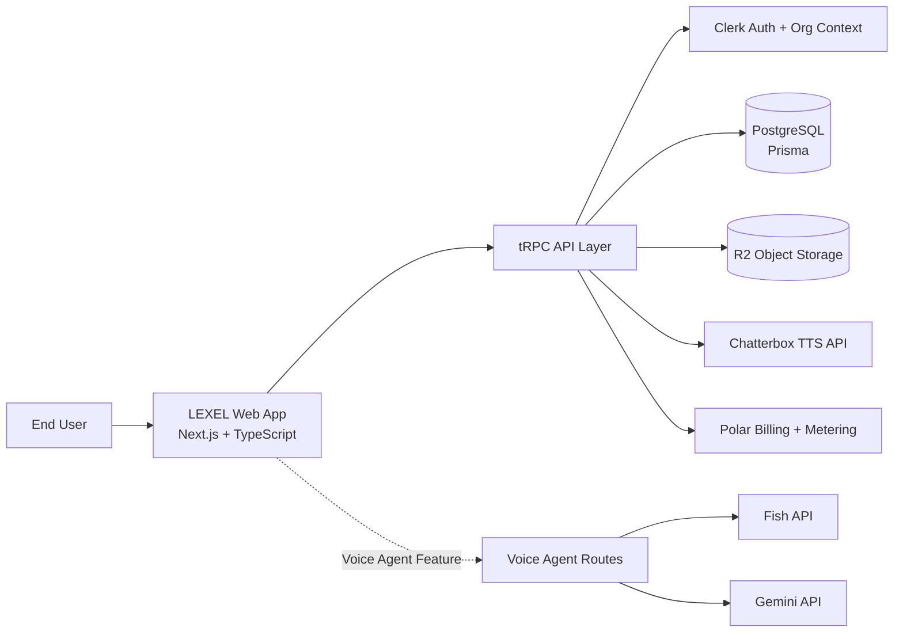
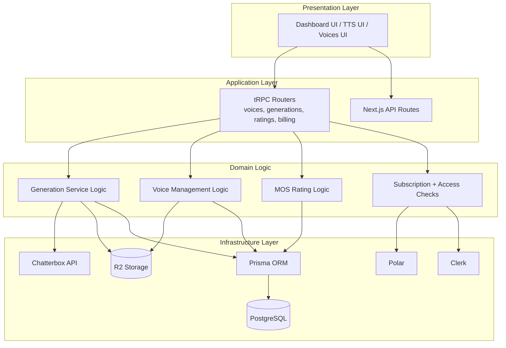
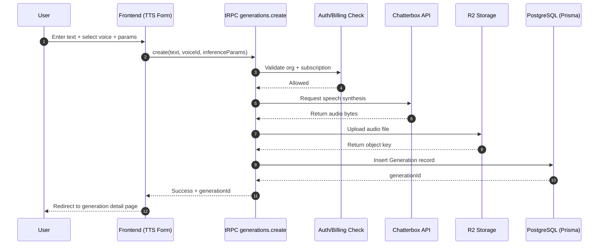
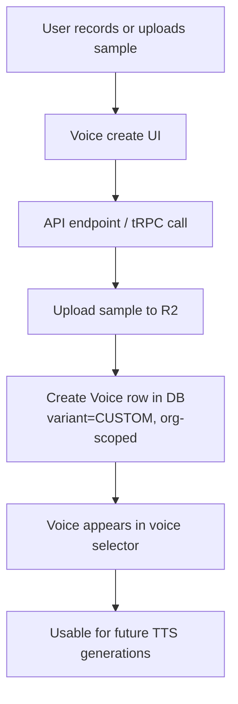
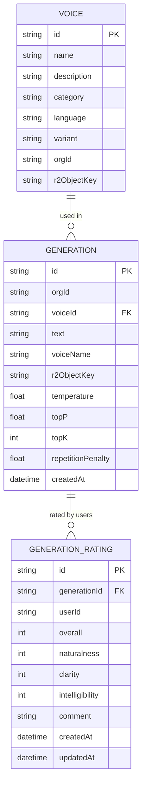
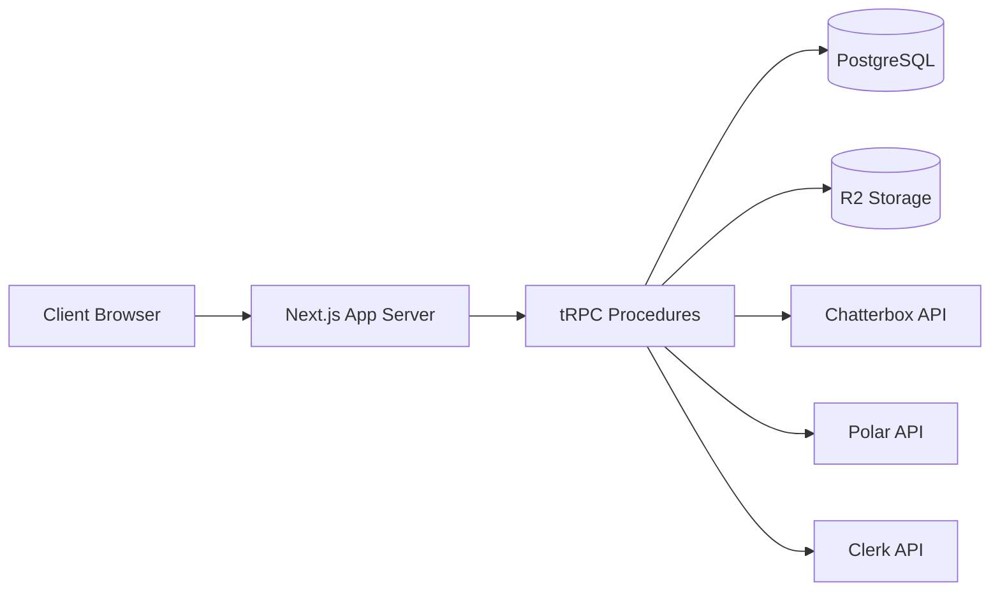

# LEXEL Mid-Term Diagrams

Use these diagrams directly in your presentation slides (Mermaid-compatible tools: GitHub Markdown, Mermaid Live Editor, many slide plugins).

---

## 1) System Context Diagram

---

## 2) Layered Architecture Diagram

---

## 3) Text-to-Speech Sequence Diagram

---

## 4) Voice Cloning Flow Diagram

---

## 5) Data Model (ER-style) Diagram

---

## 6) Deployment / Runtime View

---

## 7) Diagram Usage Tips for Slides

- Use **System Context** first (big picture).
- Then use **TTS Sequence** for "internal working".
- Use **ER diagram** when discussing technical depth.
- End with **Layered Architecture** to justify design decisions.
